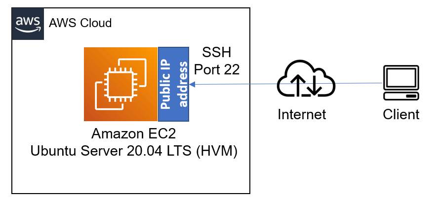
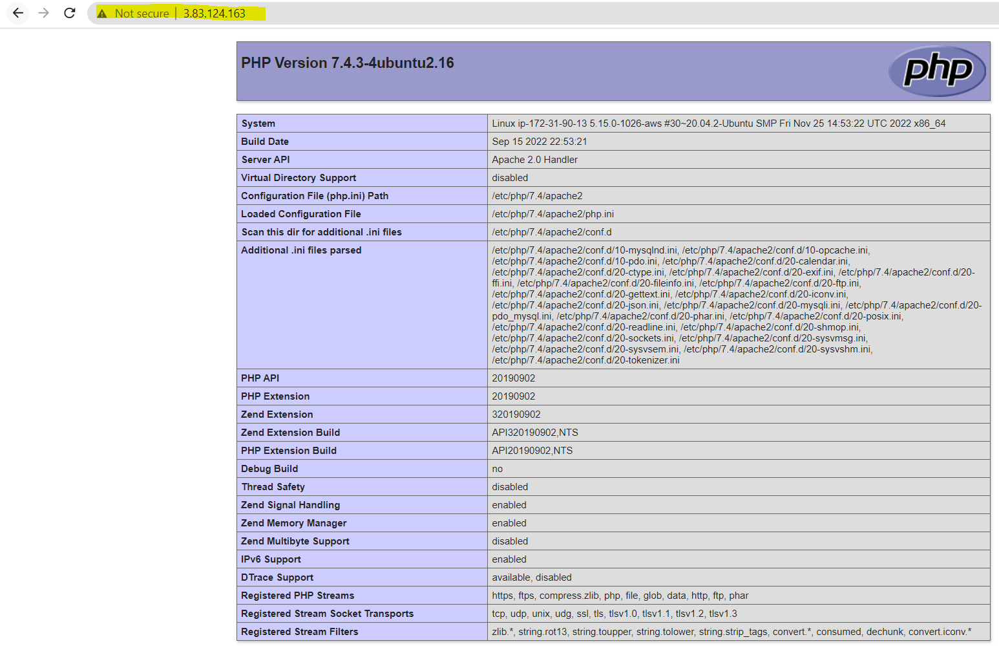

## **LAMP STACK IMPLEMENTATION in AWS**

To implement a LAMP STACK which comprises of four different web technologies (Linux, Apache, MySQL and PHP) in AWS, we need to 

**1. Install Apache and updating the firewall**

- [Create a free AWS account](https://portal.aws.amazon.com/billing/signup?refid=em_127222&redirect_url=https%3A%2F%2Faws.amazon.com%2Fregistration-confirmation#/start/email)

- [Create an EC2 instance](https://docs.aws.amazon.com/AWSEC2/latest/UserGuide/EC2_GetStarted.html)

- [Connect to the EC2 instance](https://docs.aws.amazon.com/AWSEC2/latest/UserGuide/EC2_GetStarted.html#ec2-connect-to-instance-linux)



- Next, we update a list of packages in package manager

    `sudo apt update`
- we run Apache2 package installation

    `sudo apt install apache2`
- To verify that apache2 is running as a service in our OS, we run the below code

    `sudo systemctl status apache2`


Before we can receive any traffic by our Web Server, we need to open TCP port 80 which is the default port that web browsers use to access web pages on the Internet

As we know, we have TCP port 22 open by default on our EC2 machine to access it via SSH, so we need to add a rule to EC2 configuration to open inbound connection through port 80:

First let's access it locally in our Ubuntu shell

`curl http://127.0.0.1:80`

Next, open a web browser and input the below. The out put is same as the one above but nice formatted in HTML/CSS

`http://<public-IP-Address>:80`


**2. Installing MYSQL**

- To install mySQL we run the below code

    `sudo apt install mysql-server`

- When done with installation, log into the MYSQL console by running the below code

    `sudo mysql`

It’s recommended that we run a security script that comes pre-installed with MySQL. This script will remove some insecure default settings and lock down access to your database system. Before running the script we will set a password for the root user, using mysql_native_password as default authentication method. 

    `ALTER USER 'root'@'localhost' IDENTIFIED WITH mysql_native_password BY 'PassWord.1';`

- Run the interactive script by running

    `sudo mysql_secure_installation`

- When you finished, test if you are able to log into the MYSQL console by running the below code

    `sudo mysql -p`

    `mysql> exit`

**3. Installing PHP**

We need to install PHP to process code to display dynamics contents to end users. We also need to install php-mysql, a php module that allows connection to MYSQL database. We also need libapache2-mod-php to enable apache to handle php files.

- To install these 3 packages at once, run

    `sudo apy install php libapache2-mod-php php-mysql`

- once the installation is done, we can run the following code to confirm the version of PHP.

    `php -v`

Now we have been able to Install the following listed below.

- *Linux (Ubuntu)*
- *Apache HTTP Server*
- *mySQL*
- *PHP*

**4. CREATING A VIRTUAL HOST FOR OUR WEBSITE USING APACHE**

In this project, we will set up a domain called lampProject, but we can replace this with any domain of our choice.

- create the directory for lampProject using `mkdir` command as shown below

    `sudo mkdir /var/www/lampProject`

- Next we assign ownership to the directory with the current system user

    `sudo chown -R $USER:$USER /var/www/lampProject`

- Next we create and open a config file in Apache's sites-available directory using vi command-lin editor

    `sudo vi /etc/apache2/sites-available/lampProject.conf`

- This will create and open a blank file, let's paste the below bare-bones configuration in it by clicking on `i` on the keyboard to enter the insert mode and paste the text.

```
<VirtualHost *:80>
    ServerName lampProject
    ServerAlias www.lampProject 
    ServerAdmin webmaster@localhost
    DocumentRoot /var/www/lampProject
    ErrorLog ${APACHE_LOG_DIR}/error.log
    CustomLog ${APACHE_LOG_DIR}/access.log combined
</VirtualHost>
```
- To save and close the file, Hit the `esc` button and type `:` Type, `wq` then hit `ENTER` to save the file.

- We will use the `ls` command to show thew new file in sites-available directory

    `sudo ls /etc/apache2/site-available`

- We will see 2 conf files plus the one we created.

- With this VirtualHost configuration, we’re telling Apache to serve lampProject using `/var/www/lampProject` as its web root directory

- We will use `a2ensite` command to enable new virtual host

    `sudo a2ensite lampProject`

- To make sure our configuration file doesn’t contain syntax errors, run:

    `sudo apache2ctl configtest`

- Finally reload Apache so this changes take effect.

    `sudo systemctl reload apache2`

- Our new website is now active, but the web root /var/www/lampProject is still empty. Create an index.html file in that location so that we can test that the virtual host works as expected:

    `sudo echo 'Hello LAMP from hostname' $(curl -s http://169.254.169.254/latest/meta-data/public-hostname) 'my public IP' $(curl -s http://169.254.169.254/latest/meta-data/public-ipv4) > /var/www/lampProject/index.html`

- Now we can go to our browser and try to open the URL below.

    `http://<my public IP>:80`


**5. ENABLE PHP ON THE WEBSITE**

Currently we have index.html taking precedence over index.php. To change that, we will need to edit the `etc/apache2/mods-enabled/dir.conf` file and change the order in which the file index.php file is listed.

`sudo vim /etc/apache2/mods-enabled/dir.conf`

- Add the below to the config file

```
<IfModule mod_dir.c>
        #Change this:
        #DirectoryIndex index.html index.cgi index.pl index.php index.xhtml index.htm
        #To this:
        DirectoryIndex index.php index.html index.cgi index.pl index.xhtml index.htm
</IfModule>
```

- Save and close the file, we will need to reload Apache so the changes take effect:

    `sudo systemctl reload apache2`

- Lastly, we will create a PHP script to test PHP is correctly installed and configured on our server.

    `vim /var/www/lampProject/index.php`

- This will open a blank file, input the below code in it.

    `<?php
    phpinfo();
    ?>`

- Save and close the file, refresh the page and we will see a page as shown below.



- Remember to remove the php info file created as it contains sensitive information about our environment.

    `sudo rm /var/www/lampProject/index.php`